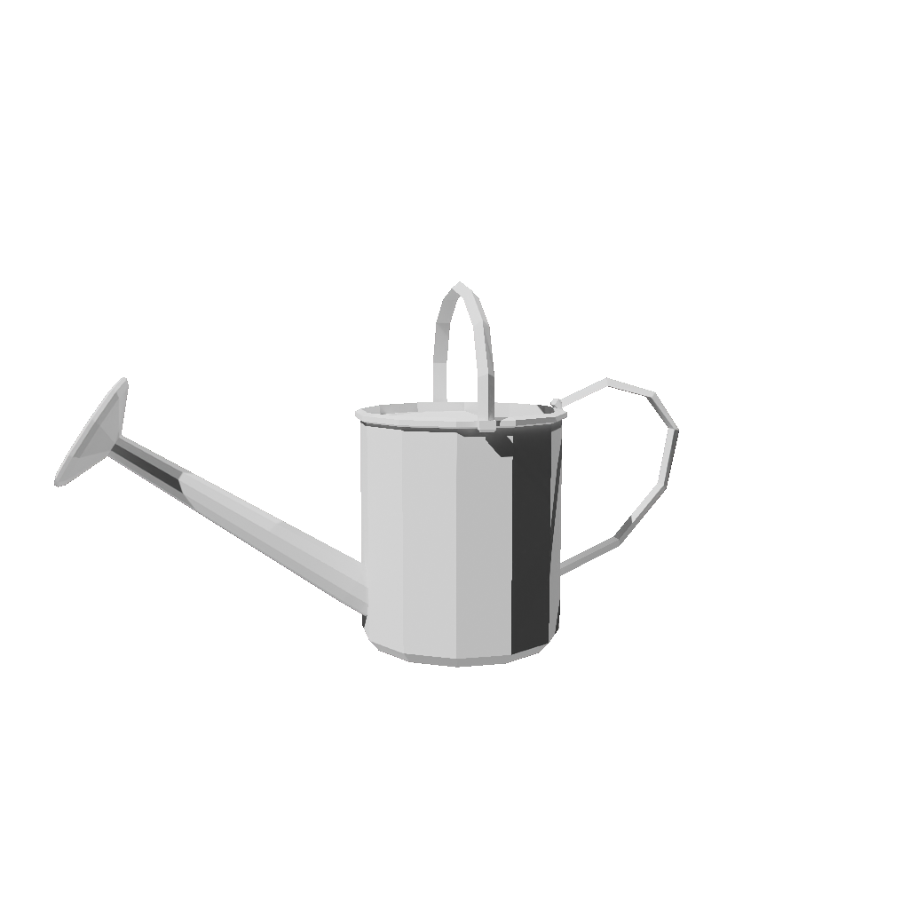
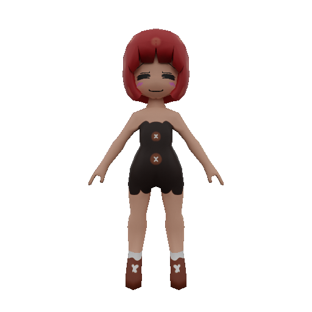
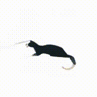
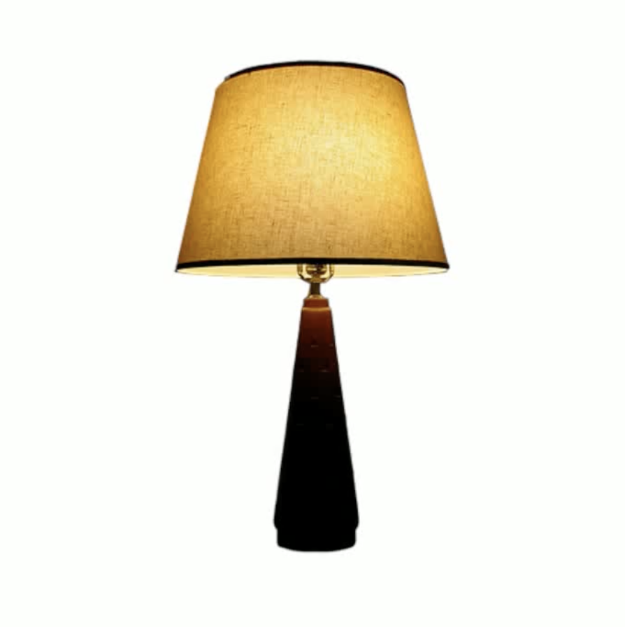
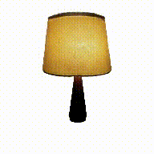
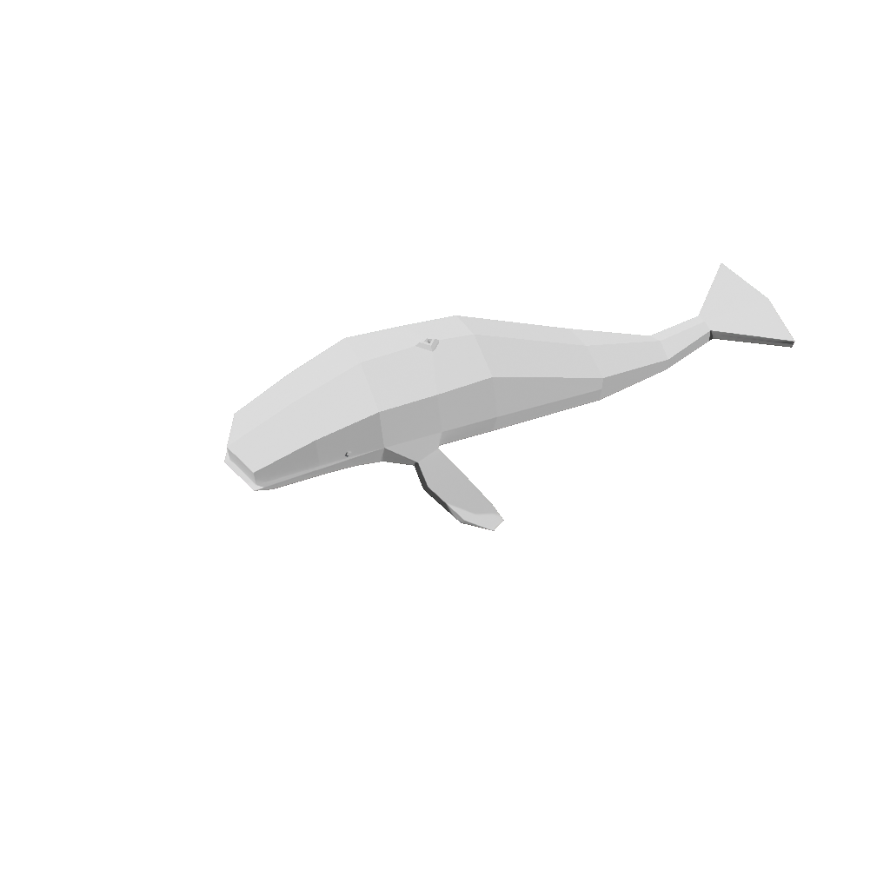
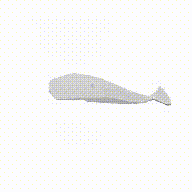

# DeepSculpt3D - Transformer-based Image/Text to 3D Reconstruction

**DeepSculpt3D** is a multimodal transformer (Encoder-Decoder) based architecture for Text or Image to 3D reconstruction, focusing on generating 3D representations from just a single 2D image of an object within seconds. The text pipeline utilizes stable diffusion methods to generate an image from a prompt, which is then passed to the model after necessary preprocessing.

## ✨ Architecture Highlights

- 🖼️ **DINO-V2** (ViT-B/16) as a frozen image encoder for robust feature extraction
- 🔺 **Custom Triplane Decoder** that projects image features onto a triplane via cross-attention and models spatial relations among triplane tokens via self-attention
- 📷 **Camera-Modulated Decoding** — camera features are injected via Adaptive Layer Normalization
- 🎯 **Volume Rendering** with coarse + fine importance sampling (NeRF-style)
- ⚡ Highly efficient and adaptable, capable of handling a wide range of multi-view image datasets

The model is trained by minimizing the difference between rendered images and ground truth images at novel views, without the need for excessive 3D-aware regularization or delicate hyper-parameter tuning.

> **Note:** Due to limited resources, a robust training wasn't performed. The attached samples are from a limited trained checkpoint.

## 🎨 Sample Results

| Input Image | Prompt | 3D Generation |
|:-----------:|:------:|:--------------:|
|  | None |  |
|  | None |  |
|  | A photograph of cat sitting on table |  |
|  | None |  |
|  | None |  |

## 🏗️ Architecture Overview

```
Input Image ──► DINO Encoder (frozen ViT-B/16) ──► Image Features [N, 1025, 768]
                                                          │
Camera Matrix ──► Camera MLP ──► Camera Embeddings [N, 1024]
                                          │               │
                                          ▼               ▼
                                   ┌─────────────────────────────┐
                                   │     Triplane Decoder         │
                                   │  (6 Transformer Blocks)      │
                                   │  Cross-Attn → Self-Attn → FFN│
                                   │  + Camera Modulation (AdaLN) │
                                   └──────────────┬──────────────┘
                                                  │
                                                  ▼
                                    Triplane [N, 3, 80, 64, 64]
                                                  │
                                                  ▼
                                   ┌─────────────────────────────┐
                                   │     Volume Renderer          │
                                   │  Ray Sampling → Importance   │
                                   │  Sampling → MLP → Ray March  │
                                   └──────────────┬──────────────┘
                                                  │
                                                  ▼
                                    RGB Images + Depth + 3D Mesh
```

## 🚀 Setup

### Clone the repository

```bash
git clone https://github.com/RITIKSHARMAOFFICIAL/DeepSculpt3D-.git
cd DeepSculpt3D-
```

### For dataset preprocessing/rendering (Linux only)

```bash
apt-get update -y
apt-get install -y xvfb
apt-get install libxrender1
apt-get install libxi6 libgconf-2-4
apt-get install libxkbcommon-x11-0
apt-get install -y libgl1-mesa-glx

echo "Installing Blender-4.0.2..."
wget https://ftp.nluug.nl/pub/graphics/blender//release/Blender4.0/blender-4.0.2-linux-x64.tar.xz && tar -xf blender-4.0.2-linux-x64.tar.xz && rm blender-4.0.2-linux-x64.tar.xz
```

### Install Python requirements

```bash
pip install -r requirements.txt
```

## 📦 Dataset Preparation

Run `load_input_data.py` to download and prepare data:

```bash
python load_input_data.py
```

Update the dataset directory in `config.json` after downloading.

> For computational constraints, it is recommended to download object data and render them individually:

**Linux:**
```bash
DISPLAY=:0.0 && xvfb-run --auto-servernum blender --background --python blender_scripts/dataset_rendering.py -- --object_path 'path to 3D object' --num_renders 32 --output_dir 'path to dataset_dir' --engine CYCLES
```

**Others:**
```bash
blender --background --python blender_scripts/dataset_rendering.py -- --object_path 'path to 3D object' --num_renders 32 --output_dir 'path to dataset_dir' --engine CYCLES
```

## 🏋️ Training

### Distributed Training (Multi-GPU)

1. Get the hostname: `hostname -i`

2. Run with `torchrun`:
```bash
torchrun --nnodes=2 --nproc_per_node=8 --rdzv_id=100 --rdzv_backend=c10d --rdzv_endpoint=$MASTER_ADDR:29400 train_ddp.py
```

Replace `$MASTER_ADDR` with the hostname of the main system.

### Single-GPU Training

```bash
python train.py
```

## 🔮 Inference

Run the `test.py` script:

```bash
python test.py \
  --checkpoint_path=<path to model checkpoint> \
  --config_path=<path to config.json file> \
  --mode=<text/image> \
  --input=<prompt/image_path> \
  --output_path=<path to output directory> \
  --export_video \
  --export_mesh
```

This will save the rendered video and mesh (`.ply` format) inside the specified output directory.

## ⚙️ Configuration

Key parameters in `config.json`:

| Parameter | Default | Description |
|-----------|---------|-------------|
| `decoder_hidden_dim` | 1024 | Transformer hidden dimension |
| `num_layers` | 6 | Number of decoder transformer blocks |
| `num_heads` | 8 | Number of attention heads |
| `triplane_res` | 64 | Triplane spatial resolution |
| `triplane_dim` | 80 | Feature channels per triplane |
| `rendering_samples_per_ray` | 128 | Coarse + fine samples for volume rendering |
| `render_size` | 128 | Output image resolution |
| `learning_rate` | 4e-4 | Learning rate (Adam8bit) |
| `batch_size` | 4 | Per-GPU batch size |

## 📚 References

### Papers
- [LRM: Large Reconstruction Model](https://arxiv.org/abs/2311.04400)
- [Efficient Geometry-aware 3D GANs (EG3D)](https://arxiv.org/abs/2112.07945)
- [TensoRF: Tensorial Radiance Fields](https://arxiv.org/abs/2203.09517)

### Open-Source Repos
- [OpenLRM](https://github.com/3DTopia/OpenLRM)
- [TensoRF](https://github.com/apchenstu/TensoRF)
- [EG3D](https://github.com/NVlabs/eg3d)

## 📄 License

Parts of the volume rendering code are derived from NVIDIA's EG3D (proprietary license) and modified by Zexin He (OpenLRM). Please refer to the individual source files for their respective licenses.
